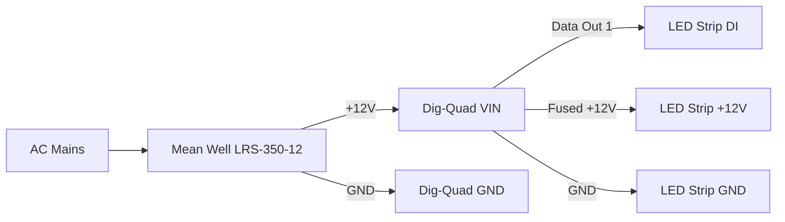

# Prototype Wiring Schematics (Dig-Quad + 12V PSU + 1 Strip + Pi)

[Wiring Guide](https://quinled.info/2020/10/03/quinled-dig-quad-wiring-guide/)

This is the **minimal bench wiring** for first bring-up.

## 1) How Pi talks to Dig-Quad

For prototype control, there is **no direct wire** between Pi and Dig-Quad.

- Dig-Quad runs WLED and is on your local network (Wi-Fi or Ethernet).
- Pi script calls WLED over HTTP:
  - `http://<WLED_IP>/json/state`

So communication path is:

```text
[Raspberry Pi 3] --(LAN/Wi-Fi HTTP JSON API)--> [Dig-Quad (ESP32 + WLED)]
```

## 2) Minimal power + data schematic (one strip)

```text
AC MAINS
   |
   v
+-----------------------+
| Mean Well LRS-350-12  |
|   +V            -V    |I'm
+----|------------|-----+
     |            |
     |            +---------------------> Dig-Quad GND
     |
     +----------------------------------> Dig-Quad VIN (+12V)

Dig-Quad Output #1:
  DATA1 --------------------------------> Strip DI (Data In)
  GND ----------------------------------> Strip GND
  +12V (fused output) ------------------> Strip +12V

Power path summary: 
  PSU +12V/GND -> Dig-Quad VIN/GND -> Dig-Quad fused output -> Strip +12V/GND
```

## 3) Terminal-level checklist

Use this as a wiring checklist (names may vary slightly by board revision).

1. PSU `+V` -> Dig-Quad `VIN/+12V`
2. PSU `-V` -> Dig-Quad `GND`
3. Dig-Quad Output 1 `DATA` -> strip `DI`
4. Dig-Quad Output 1 `GND` -> strip `GND`
5. Dig-Quad Output 1 fused `+12V` -> strip `+12V`

For longer runs later, direct PSU injection points are optional, but each branch must be fused.

If your strip has backup-data (`BI`) and your Dig-Quad output exposes backup data, you can wire it later; not required for first bring-up.

## 4) First power-on constraints (important)

- Set WLED brightness limit low for bench start (e.g. 50-80 / 255).
- Confirm controller and strip share ground.
- Confirm you connected to the strip **input** end (arrow direction).
- Never hot-plug data/power while PSU is on.

## 5) Mermaid diagrams (copy into docs/Notion/GitHub)

### Network control diagram


### Wiring diagram



## 6) Breadboard-style visual options

Dig-Quad is a custom board, so auto-generated breadboard visuals are limited compared to Arduino kits.

Best practical options:

1. **Fritzing (manual but pretty)**
   - Use generic terminal blocks + PSU + LED strip symbols.
   - Represent Dig-Quad as a labeled custom block.
2. **diagrams.net / draw.io (fastest clean schematic for collaborators)**
   - Use the wiring mapping above directly.
3. **Wokwi (best for logic simulation, not ideal for Dig-Quad hardware drawing)**

If you want, I can create a `prototype/wiring.drawio` source template next with the exact blocks and labels pre-filled.
